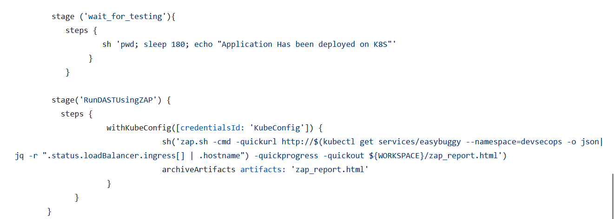

# DAST 

- test a running application for vulnerabilities like SQL Injection and Buffer overflows.
- can be embedded into CI/CD pipelines.
- Opensource tool for DAST - OWASP ZAP
- Free license one is Burp Suite

# OWASP 
- It is a non profit organisation with aim of improving security of software.
- produce multiple projects which help with  areas of security like tooling, testing guides and vulnerable software to test against and many more

# ZAP (**Z**ed **A**ttack **P**roxy)

- penetration testing tool
- opensource web application security scanner.
- Supports Windows, Linux and Docker.
- works as a proxy (man in the middle)
- it sits between the user and web application running on the browser, intercepts and inspects all the traffic.
- provides alerts which explains the vulnerabilities found against the web application.
- It can scan both web applications and API specifications.

## Integrate DAST in jenkins

We have already installed zap on the ec2 instance when we created the infrastructure using terraform.

#### Update the Jenkins file

#### Create Jenkins job and configure

#### Run the job

